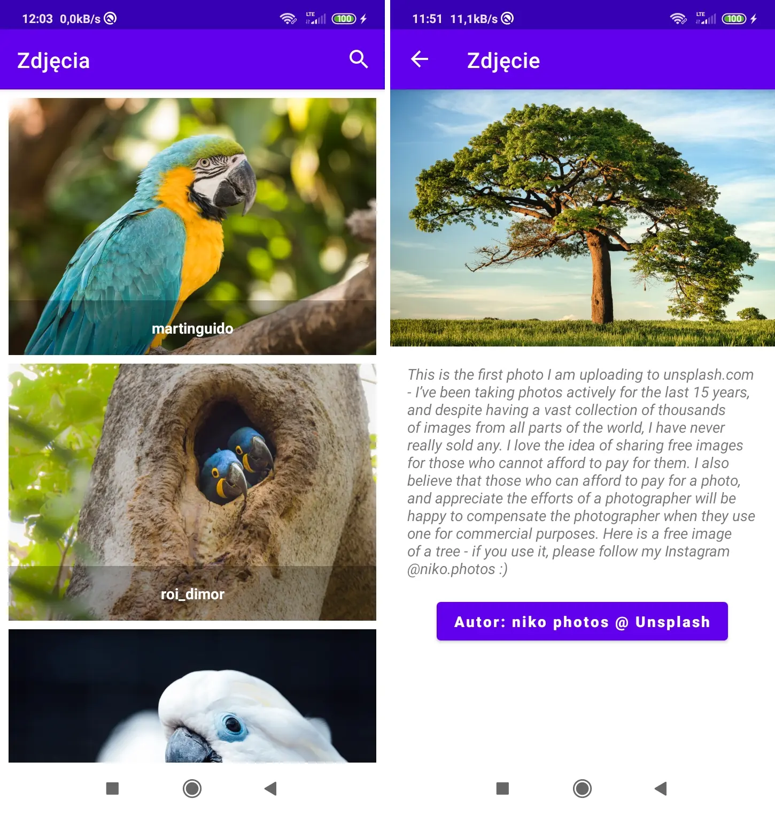

# Zdjęcia

Zdjęcia to aplikacja mobilna Android napisana w języku Kotlin, która w 95% oparta jest na dostępnym w YouTube tutorialu autorstwa Coding in Flow. Aplikacja umożliwia wyświetlenie zdjęć z serwisu Unsplash wg wyszukiwanego słowa.

Oryginalna wersja:
- repozytorium GitHub: [ImageSearchApp](https://github.com/codinginflow/ImageSearchApp),
- playlista YouTube: [MVVM Image Search App with Architecture Components & Retrofit](https://www.youtube.com/playlist?list=PLrnPJCHvNZuC_pEfFlZuTmjlY4T3DTtED).

Użyte technologie:
- MVVM (View Model),
- LiveData,
- View Binding,
- Navigation Component, 
- Dagger Hilt, 
- Retrofit (z Coroutines), 
- Paging 3, 
- Glide.

Główne różnice:
- oryginalną wersję opublikowano we wrześniu-październiku 2020 roku, a tę napisano we wrześniu 2021 roku,
- zaktualizowano zależności na tyle, na ile to było możliwe bez ingerencji w implementację,
- spolszczono i nieznacznie ulepszono interfejs użytkownika.

Aplikacja powstała w celach edukacyjnych. Nie jest wydana w Google Play ani gdziekolwiek indziej. Nie są planowane jej aktualizacje. To repozytorium istnieje wyłącznie w celach referencyjnych i odpowiada tylko na najważniejsze pytanie: jak coś w Androidzie zrobić dobrze?

UWAGA: do działania wymagane jest posiadanie własnego klucza dostępu do Unspash API. Ten klucz ("Access Key") należy umieścić w `gradle.properties`.

